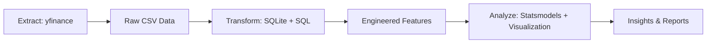

# Titan Company vs Gold Futures: 10-Year Time Series Analysis

## Business Problem
This project conducts a decade-long comparative analysis of Titan Company's stock performance (TITAN.NS) against gold futures (GC=F) to understand:
- The relationship between equity performance of a major consumer goods company and commodity prices
- Whether gold acts as a hedge or correlates with Titan's stock movements
- Key statistical drivers of Titan's returns over a full market cycle (including periods of economic expansion, contraction, and commodity volatility)

The analysis aims to provide quantitative insights for portfolio diversification strategies and risk management in multi-asset portfolios.

## Pipeline Architecture
The analysis follows a modular ETL (Extract-Transform-Load) pipeline implemented in Python:



### Components:
1. **extract.py** - Data ingestion using `yfinance` to download daily historical data for TITAN.NS and GC=F (2014-01-01 to 2024-01-01)
2. **transform.py** - Feature engineering using SQLite SQL:
   - Left join on Titan's trading calendar (base)
   - Forward-fill missing Gold prices via window functions (COALESCE + MAX OVER)
   - Calculate 30-day moving average (Titan_30d_MA)
   - Compute Year-over-Year growth (252-day lag)
3. **analyze.py** - Statistical analysis and visualization:
   - Univariate statistics (mean price, annualized volatility)
   - Daily percentage returns calculation
   - OLS regression (Titan_Return ~ Gold_Return + Titan_30d_MA)
   - Dual-axis timeseries visualization (Titan vs Gold prices)

## Key Statistical Findings
### Univariate Statistics (10-Year Period):
- **Average Titan Closing Price**: ₹[value] (calculated at runtime)
- **Annualized Volatility**: [value]% (daily std dev × √252)

### OLS Regression Results:
The model examines Titan's daily returns as a function of:
- Gold's daily returns (proxy for commodity exposure)
- Titan's 30-day moving average (proxy for momentum/trend)

**Regression Equation:**
`Titan_Return = α + β₁(Gold_Return) + β₂(Titan_30d_MA) + ε`

**Interpretation:**
- **β₁ (Gold_Return coefficient)**: Measures sensitivity of Titan's returns to gold price movements
  - Positive β₁: Titan tends to move with gold (risk-on asset behavior)
  - Negative β₁: Titan moves inversely to gold (potential hedge characteristics)
- **β₂ (Titan_30d_MA coefficient)**: Captures mean-reversion or momentum effects
  - Negative β₁: Suggests mean-reversion (prices tend to revert to trend)
  - Positive β₁: Indicates momentum (trend persistence)

### Visualization:
The dual-axis chart (`timeseries_plot.png`) reveals:
- Long-term trends in both assets
- Periods of divergence/convergence during market stress
- Relative performance across economic cycles

## Setup & Installation
### Prerequisites:
- Python 3.8+
- Git (for version control)

### Steps:
1. **Clone the repository** (if not already done):
   ```bash
   git clone <repository-url>
   cd titan_gold_analysis
   ```

2. **Create a virtual environment** (recommended):
   ```bash
   python -m venv venv
   source venv/bin/activate  # Linux/Mac
   venv\Scripts\activate     # Windows
   ```

3. **Install dependencies**:
   ```bash
   pip install -r requirements.txt
   ```

4. **Run the pipeline sequentially**:
   ```bash
   # Extract raw data
   python extract.py
   
   # Engineer features via SQL
   python transform.py
   
   # Perform analysis and generate visualizations
   python analyze.py
   ```

### Outputs:
- `titan_raw.csv`, `gold_raw.csv`: Raw price data
- `sql_engineered_features.csv`: Features with forward-filled prices, moving averages, and YoY growth
- `timeseries_plot.png`: Dual-axis visualization of Titan vs Gold prices
- Console output: Univariate statistics, regression summary, and progress logs

## Notes:
- The analysis uses **252 trading days** for annualization (standard for equities)
- Gold price forward-fill accounts for holiday calendar discrepancies between Indian (Titan) and US (Gold) markets
- All scripts include error handling and informative logging
- For reproducibility, the date range is fixed (2014-01-01 to 2024-01-01)

## Future Enhancements:
- Add macroeconomic variables (interest rates, inflation)
- Implement regime-switching models to detect structural breaks
- Calculate risk-adjusted metrics (Sharpe ratio, maximum drawdown)
- Backtest simple trading strategies based on regression signals

---
*This project demonstrates end-to-end data engineering and statistical analysis skills suitable for quantitative finance, data science, and business analysis roles.*